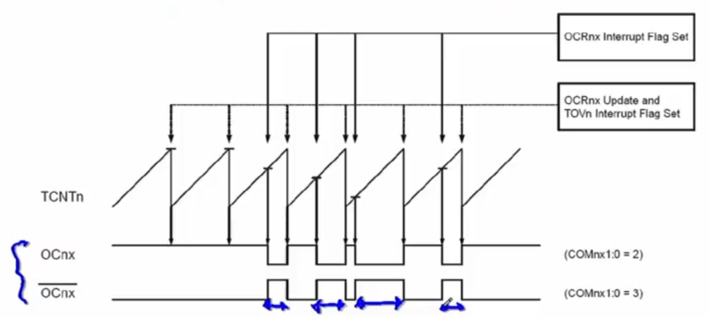
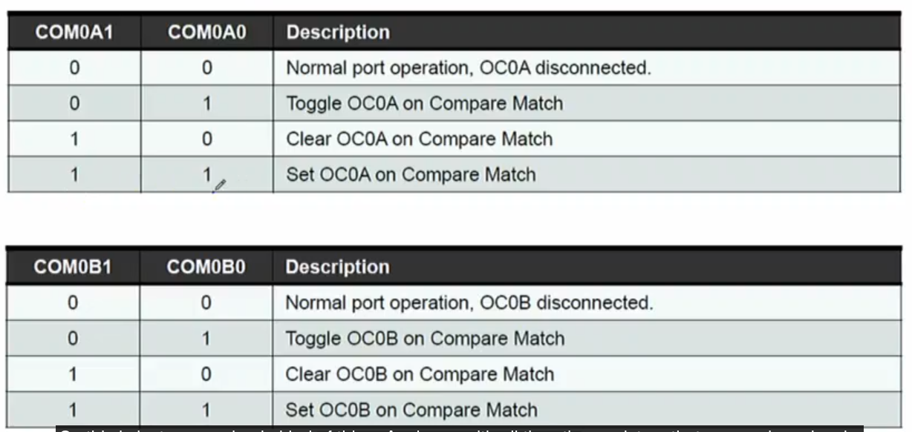
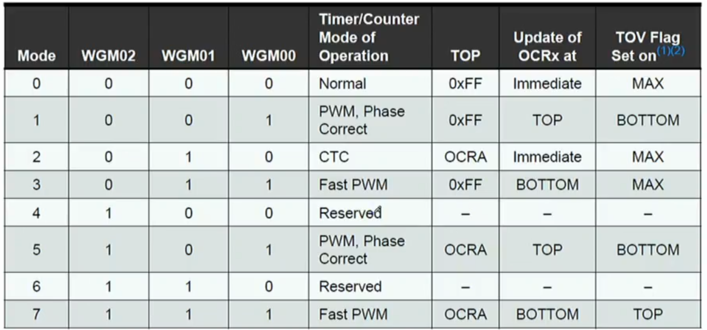

#### Timers/Counters in AVR

Work in parallel without delaying CPU

Timer Interrupts:
- OCFxA: the counter equalling OCRxA
- OCFxB: the counter equalling OCRxB
- TOVx: the counter overflowing 

CTC mode
- clears timers when reaching OCRxA

PWM mode
- TOP is defined by OCRxA
- OCxn is compared to generate the waveform

Phase Correct PWM Mode
- Counts up then counts down
- Makes symmetrical signals

prescalers is used to measure longer times

#### Timer0 Features and Registers
8-bit synchronous timer (synchorous with CPU clock, T0 clock & CPU clock)
Alternative clock signal can be inputted through T0

For CTC & Normal mode

#### Timer1 Features - Input Capture Unit
#### Timer2 Features - Asynchronous Clock

Timer2 is asynchronous 

ASSR (Async status register) has two bits of interest, EXCLK & AS2