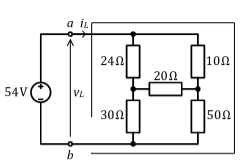
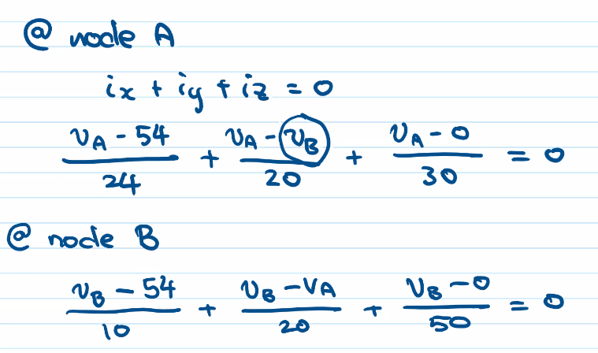

# Equivalent Resistance

$$R_{eq} \space (series) = \sum R_n$$
$$R_{eq} \space (parallel) = \frac{1}{\sum \frac{1}{R_n}}$$

#### Not Parallel or Series
$\frac{v}{i} = R$ is always golden

Use *Nodal Voltage Analysis!*

$$ \left( \frac{1}{24}+\frac{1}{20}+\frac{1}{30} \right) v_A - \frac{v_B}{20} = \frac{54}{24}$$
