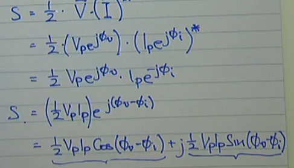

$\text{p.f.} = \cos(\phi_v - \phi_i)$

Instantaneous power: $p(t) = v(t) \cdot i(t)$
$$p(t) = P + P \cos(2 \omega t) + Q \sin(2 \omega t)$$

Average Power : $P=\frac{1}{2}V_pI_p\cos(\phi_v - \phi_i)=S\cdot\text{p.f}$
- average power will return 0 if load is purely reactive (capactive or inductive)

Reactive Power : $Q=\frac{1}{2}V_pI_p\sin(\phi_v-\phi_i)=S\cdot\sqrt{1-\text{p.f.}^2}\cdot-\text{isLeading}$
- reactive power will return 0 if load is purely resistive

Apparent Power : $|S| = \frac{1}{2}V_pI_p$

#### Complex Power $\mathbb{C}$
$$Z = re^{j\phi},\space Z^* = re^{-j\phi}$$
$$S = \frac{1}{2} \cdot \overline V \cdot \overline I^* = \overline V_{rms} \cdot \overline I_{rms}^*$$
$$P = \Re(S)$$
$$Q = \Im(S)$$
Complex power: $S$

