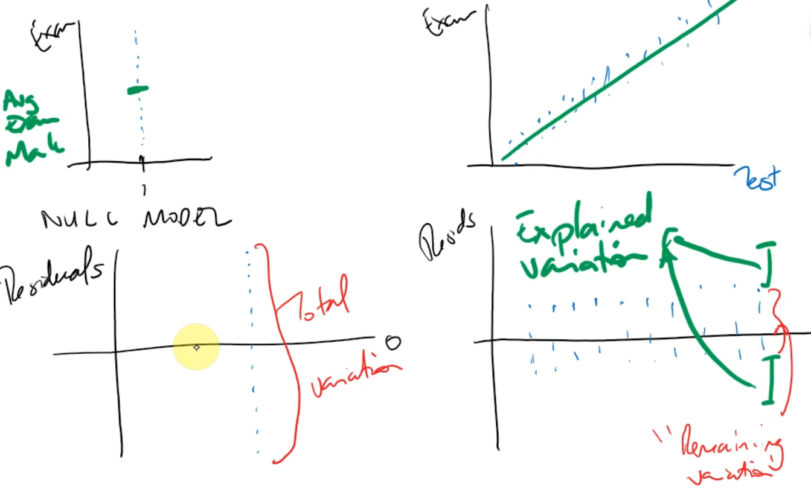
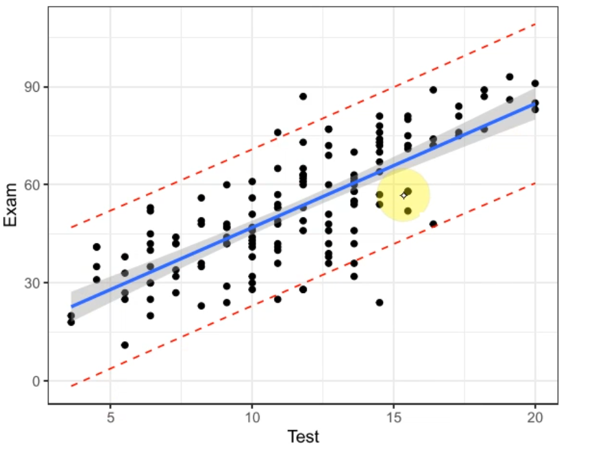

# DA Block 2A
##### Simple Linear Regression
$$y=mx+c$$
$$y = \beta_0 + \beta_1 x$$

Assumptions
- $\epsilon \sim N(0, \sigma^2)$
- Indpendence
- Equality of Variance (EOV)
- Normality of Errors

Cook's Distance is a plot of 'leverage' of a datapoint on the trendline
If Cook's distancce is greater than the value of 0.4, then removal of the point changes any parameter estimates by mor ethan one standard error
Basically remove if >0.4 cook's distance

# DA Block 2B
$R^2$ is a goodness of fit measure
Use **Multiple R Squared** NOT Adjusted R Squared

Total variation is the variation from the mean
Remaining variation is the variation with a linear model
Explained variation is the difference between remaining and total variation


If $R^2 > 80\%$ and other modelling assumptions are satisfied, the model is probably good
for prediction

Null model: $y = \beta_0 + \epsilon$ variables are unrelated

When writing reports have the coeffecients as a range from confidence intervals

**predicting using R**
```R
preds.df=data.frame(Test=c(x, y, z))
predict(examtest.fit, preds.df)

# interval = 'prediction' or 'confidence' can be added to 
# get those specific intervals for the test values
```

To estimate variability of the average dependent variable given the independent variable use **confidence intervals**

To estimate the dependent variable for a given independent variable use **prediction intervals**



- Red dashed line: prediction interval
- Grey Shaded area: confidence interval for the mean
- Blue line: mean

Extrapolation is dangerous!
If asked to predict values out side of the observed independent variable range do the prediction and state why this is dangerous

