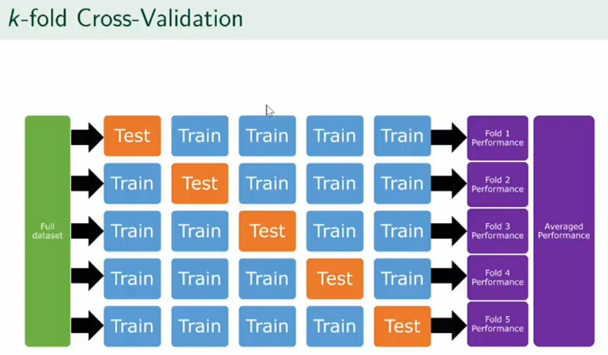
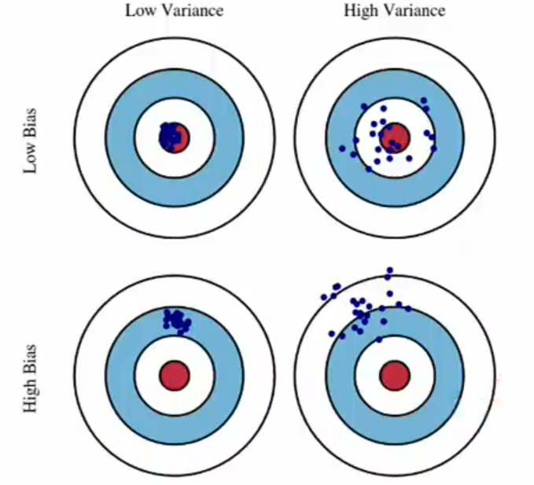

Root Mean Square Errors

Using a single training set-test set split
- Unusual training set by chance
- Unusual test set by chance

Alternative Testing method

#### Problems in Machine Learning

**Feature and Target Engineering**, creating new variables from existing ones.
- Processing text data into numeric variables
- measuring all variables with standard deviation units to make them all on the same scale
- calculating values of a variable - differences
- grouping together values - like for privacy
- image recognition
- transforming data

**Bias-Variable Trade off**
- overfit when the model fits the training set too well and the model cannot generalise to unseen data
- underfit when we fit too simple a model so the predictions are biased

**Missing data**

**Class Imbalance**
- The dataset is useless for answering the question of interest
- The machine learning might 'cheat' to get shortcut that gets the answer right most of the time but unrelated to factors we care about
- using the model data points that are totally different to what the model was trained with

**Historical Bias**
- Machine learning models replicate human biases
- 