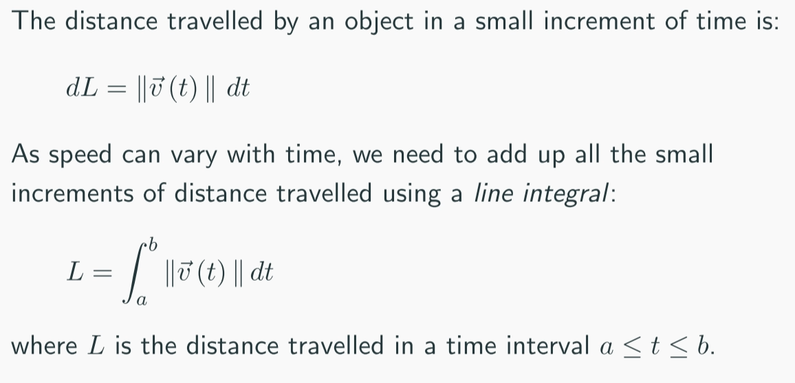
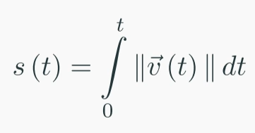
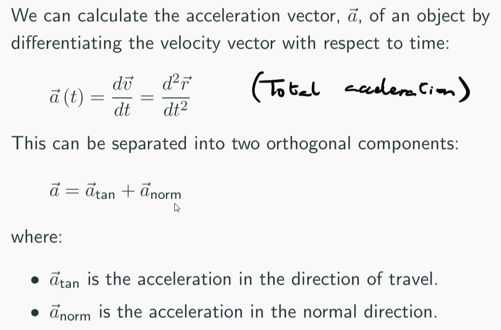
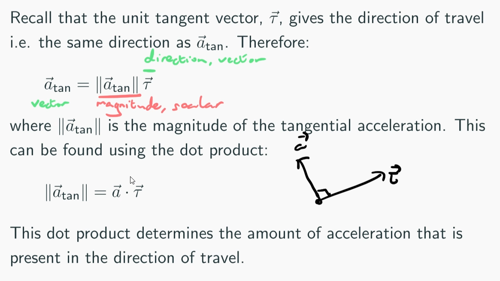

# Space Curves

General Expression for Distance

The position vector can also be parameterised by arc length $s$.
Then $||\overrightarrow v(s)||=1$.  So $v(s) = \tau(s)$.

$$ \textbf{a}_{\text{norm}} = \textbf{a} - \textbf{a}_{\text{tan}}$$

#### Work done

$$W = \int^b_a \vec F(t) \cdot \vec v(t) \space dt$$
