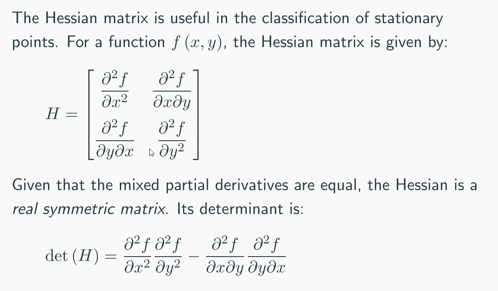

# Differential Calculus 2
$\frac{d^2 f}{dx^2} > 0: \text{local minimum}$
$\frac{d^2 f}{dx^2} < 0: \text{local maximum}$
$\frac{d^2 f}{dx^2} = 0: \text{local minimum, maximum or inflection point}$

if all partial derivative of a multivariable function are equal to zero
$$ f(x,y) $$
$$ \frac{\partial f}{\partial x} = \frac{\partial f}{\partial y} = 0 $$
then these coordinates could be 
 - Local minimum
 - Local maxiumum
 - Saddle point (local minimum in one direction, local maxiumum in another)

#### Finding Stationary Points
- Factorise your first-order derivatives as far as possible
- Find all possible $x$ and/or $y$ values that satisfy one of these partial derivatives equal to zero
- Pick equations that is the most factorised
- For each value of $x$ and/or $y$ found in the previous step, substitute into the other partial derivative and determine under what conditions it is also equal to zero

#### Classifying Stationary Points

$det(H) > 0, \space \frac{\partial^2 f}{\partial x^2} > 0, \space \frac{\partial^2 f}{\partial y^2} > 0: \text{local minimum}$
$det(H) > 0, \space \frac{\partial^2 f}{\partial x^2} < 0, \space \frac{\partial^2 f}{\partial y^2} < 0: \text{local maximum}$
$det(H) < 0: \text{saddle point}$
$det(H) = 0: \text{inconclusive}$