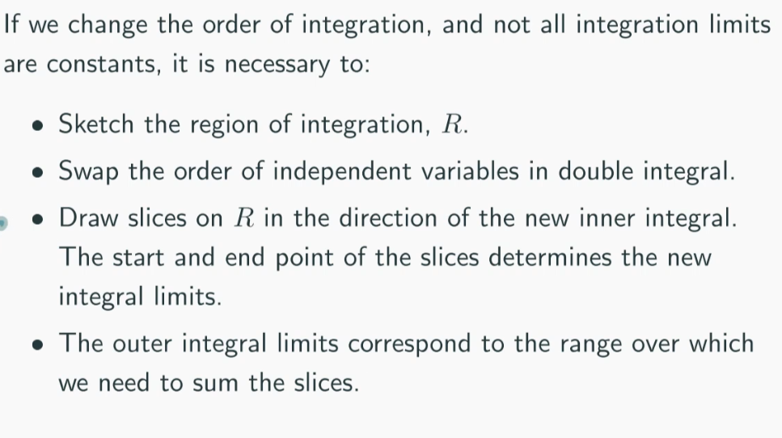
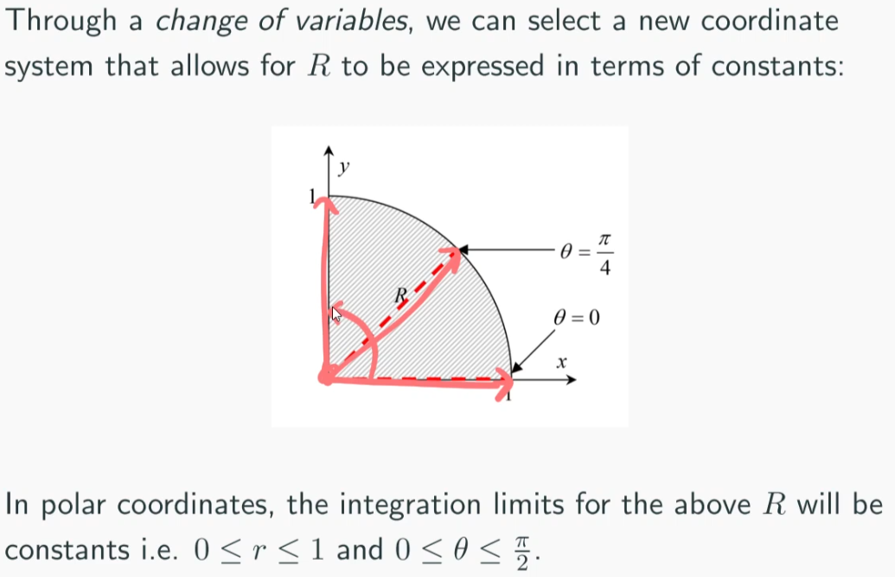

# Integral Calculus 2
changing the order of integration with non-consant limits.

#### Change of Variable

polar/cartesian coordinate systems relationship
$x = r \cos (\theta)$
$y = r \sin (\theta)$
$dx\cdot dy = r \cdot dr \cdot d\theta$
$|J| = r$
