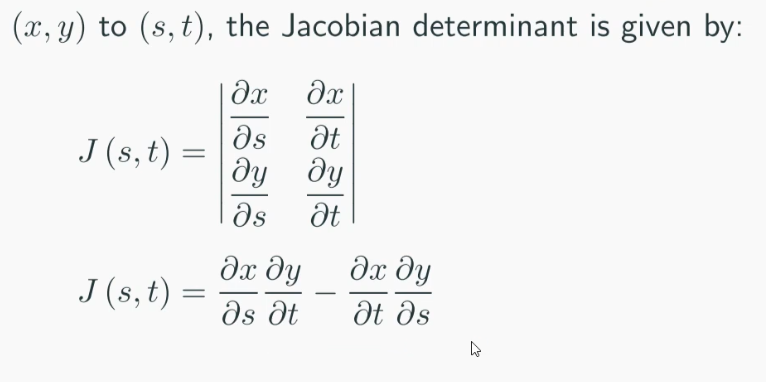

# Integral Calculus 3

Change of variable 
- Sketch the region of integration
- Identify a suitable new coordinate system
- Determine the new integration limits, ideally as constants
- Determine the Jacobian determinant
- Re-write the scalar function in terms of the new coordinates

slices done at constant values of the variable held constant in the inner integral

$$\int\int_R f(u, v) |J| \space du \space dv$$