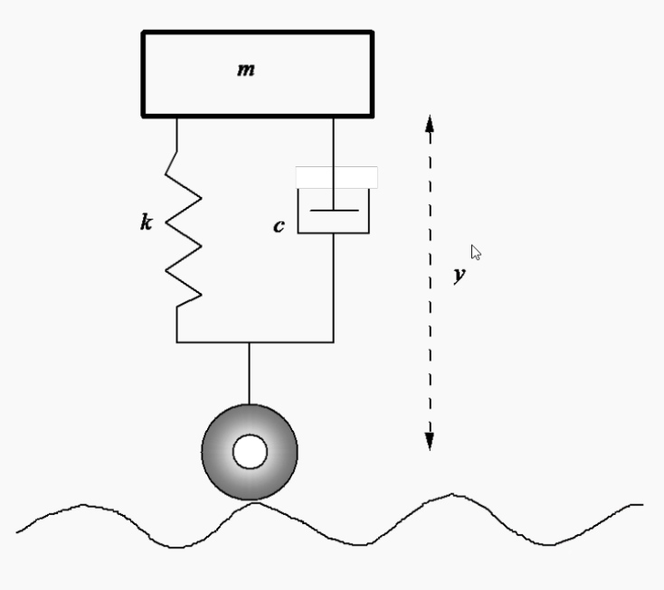
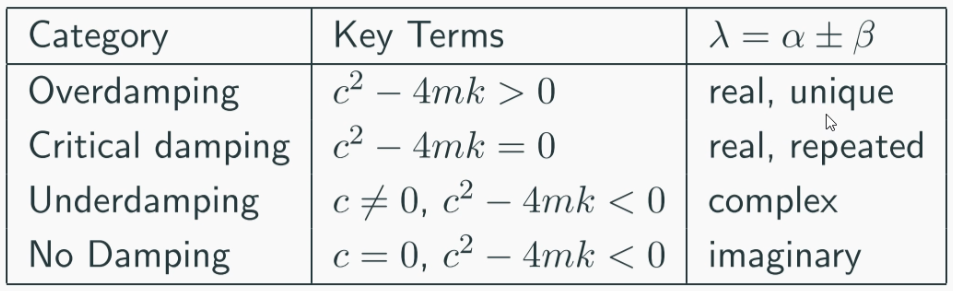
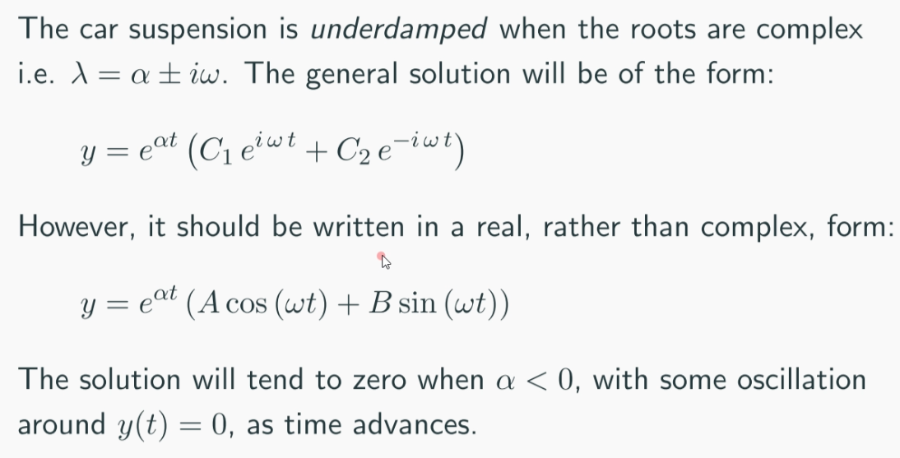

## Car Suspension System

Treating $y$ (vertical displacement of the car) as the independent variable
- $y>0:$ spring is compressed
- $y<0:$ spring is stretched
- $y=0:$ spring is at its natural length

Key Parameters
- Spring Modulus $k>0$
- Damping constant $c>0$
- Car mass $m>0$

Using Newton's law $ma=F$
$$ m \frac{d^2 y}{dt^2} = -ky - c\frac{dy}{dx} + f(t)$$
where $f(t)$ being an external force

Governing equation being 
$$ \frac{d^2 y}{dt^2} + \frac{c}{m}\frac{dy}{dx} + \frac{k}{m}y= f(t)$$

Solving

$$\frac{d^2 y_c}{dt^2} + \frac{c}{m}\frac{dy_c}{dx} + \frac{k}{m}y_c=0$$
$$\lambda^2 + \frac{c}{m} \lambda + \frac{k}{m} = 0 $$
$$\lambda = \underbrace{-\frac{c}{2m}}_{\alpha} 
\pm \underbrace{\frac{\sqrt{c^2 - 4mk}}{2m}}_{\beta}$$

### Overdamping

Tends to zero without oscillation $\lambda$ is real unique and negative

### Critical Damping

This is a problem. To preserve linear independence a solution must be multiplied by 
the independent variable
Tends to zero without oscillation if negative.

### Underdamping

$e^{\alpha t}$ provides decay when $a<0$
while oscillation is provided by the trignometric expressions

### No Damping

$\alpha = 0, \beta = \text{imaginary}$
$y$ contains only trignometric functions

### Example 2.2.8

$y = y_p$ in some cases

### Example 2.2.9