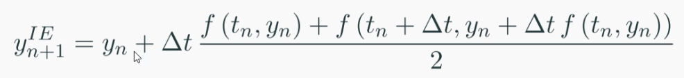
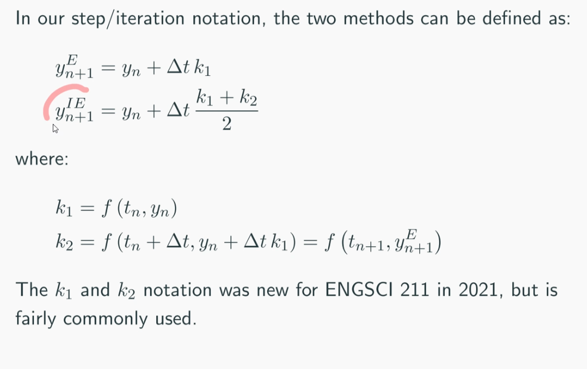

Not all ODEs can be solved analytically.

Numerical solution methods:
- Euler Method
- Improved Euler Method

To apply these methods to second order and higher ODEs they *must be converted* 
into a system of first order ODEs which is called a *system form*

#### Euler Method
$$\frac{dy}{dx} = f(t, y)$$
$$y(t + \Delta t) = y(t) + \Delta t f$$

Error per step: $\epsilon \propto (\Delta t)^2$

#### Improved Euler Method
uses two derivative evaluations

Error per step: $\epsilon \propto (\Delta t)^3$

#### Governing Equations

$k_1$ derivative evaluation at the start of the step
$k_2$ derivative evaluation at the end of the predicted step

