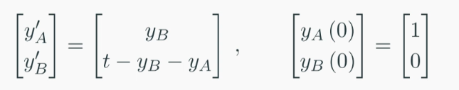

# Numerical Methods 2

### System Form
$$ \frac{d^2y}{dt^2} + \frac{dy}{dt} + y = t$$
$$ \frac{d}{dt}\left( \frac{dy}{dt} \right) + \frac{dy}{dt} + y = t$$
substitution
$$y_A = y, \space\space y_B = \frac{dy}{dt}$$
$$ \frac{dy_B}{dt} + y_B + y_A = t $$
first order ODE for each substution variable
$$ \frac{dy_A}{dt} = y_B$$
$$ \frac{dy_B}{dt} = t - y_B - y_A $$

