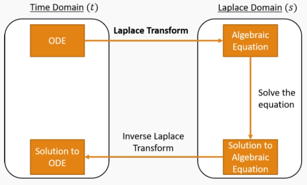

# Laplace Transform 1
$$ L\{f(t)\} = \int^{\infty}_{0} f(t)e^{-st} \space dt $$
$$ F(s) = L\{f(t)\} $$
$$ f(t) = L^{-1}\{F(s)\}$$

Formula sheet has a lookup table for Laplace Transforms

### Solving an ODE with Laplace Transforms

##### Example 2.4.1
Can invidually take the laplace transform of each term
