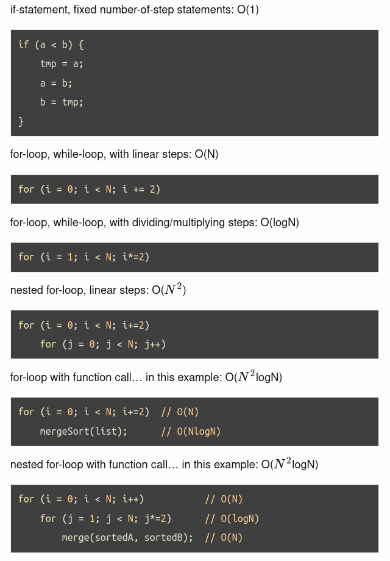

#### Circular Array
\# of dequeues = frontIndex
\# of enqueues = backIndex

#### Big O Notation

#### Stacks and Queues
1. The stack operates on a first in last out basis.

2. The queue operates on a last in last out basis.