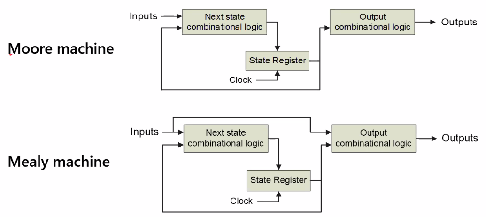
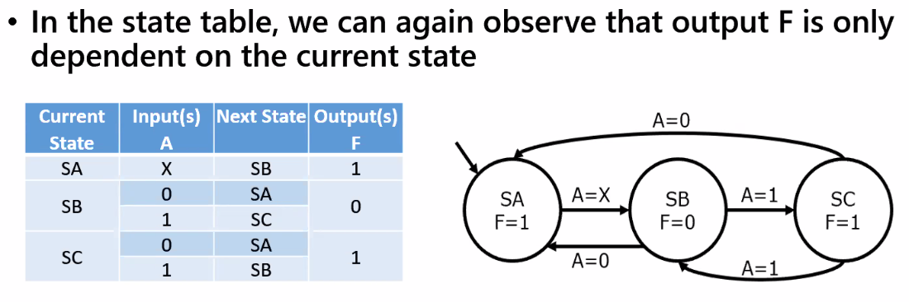

# Finite State Machine
Finite State Machines are for sequential circuit design

Six Elements
- The input alphabet ($\Sigma$)
- The output alphabet ($\Gamma$)
- The finite set of states ($S$)
- The initial state ($S_0$)
- The state transition function ($\delta$)
- The output function ($\omega$)

A sequential circuit is combinational logic + memory elements

Moore machine depends on the stored state
Mealy machine depends on the current and stored state

Mealy FSM Diagram has output variables on the arrows

Mealy machine typically requires fewer states, operates faster and requires less resources. However the mealy machine is less stable as a fluctuating output can affect the result

If next state and output are the same for two states they are equivalent and one of the states are redundant
