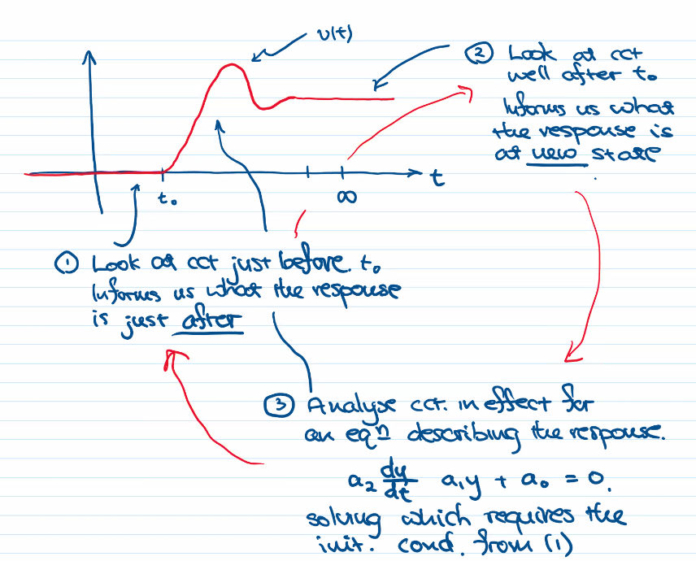

the state between steady states is called the transient state

capacitators can be combined in series

All First-Order circuits follow:
$$y = i \space\text{or}\space v$$
$$y(t) = K_1 + K_2 e^{- \frac{t - t_0}{\tau}}$$
$$y(\infty) = K_1 + 0$$
$$y(t_0^+) = K_1 + K_2$$
$$y(t) = y(\infty) + (y(t_0^+) - y(\infty))e^{- \frac{t - t_0}{\tau}}$$
$$\tau = R_{TH}C = \frac{L}{R_{TH}}$$

Can be simplified as thevenin equivalent from the capacitor or inductor

circuit is at 'steady state' at $5\tau$ because $99\%=1-e^{-5}$