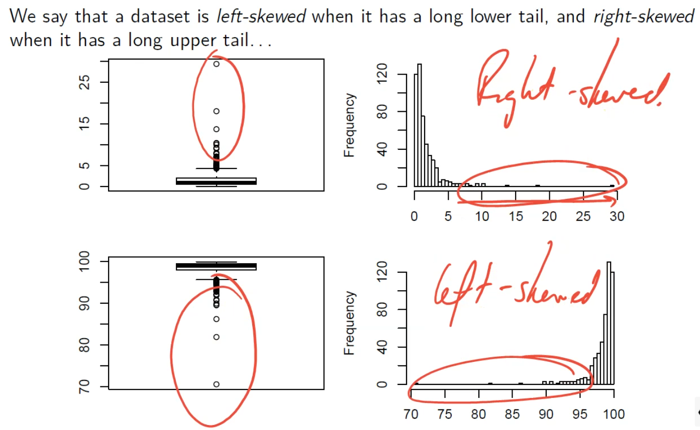

# DA Block 1A

Statistical inference is estimating a value of a population (usually the mean) from a subset (*sample*) of the population

Dataframes are a spreadsheet, 2 dimension matrix.
`.` in R is just used as a part of variable names and is not a part of the languages grammar

##### Skew

##### Measures of Centrality
- Mean
- Median
- Mode

##### Measures of spread
The sample standard deviation (`sd` in R), $s$, is a measure of the variability or spread of the data
$$s = \sqrt{ \frac{ \sum^n_{i=1} (x_i - \overline{x})^2 }{n} }$$
Standard error $se$ is sample to sample varibility
$$se(\overline{x}) = \frac{s}{\sqrt{n}}$$

##### Confidence Intervals
`t.test` function in R gives the 95% confidence interval

##### Hypothesis Testing
Two competing hypotheses
- Null Hypothesis $H_0$: 
- Alternative Hypothesis $H_1$

**P-value**
The probability that we observe a test statistic at least as unusual as the one we have from our sample, given that the null hypothesis ($H_0$) is true

reject $H_0$ when the p-value is less than 0.05 -- this is statistically significant
NEVER have evidence for $H_0$

`mu = <number>` in `t.test`

sample must be random and independent of other values

`library(s20x)` , `normcheck()`
if normal distribution believable if data point are close to the straight line
in the Q-Q plot

Central Limit Theorem: the distribution of the sample means $\overline{X}$ is approximately normal even if the distribution we are sampling from is not normal
$n > 30$, CLT can be invoked reliably

##### Two-sample Analysis
comparing some measurement between two populations

$H_0: \mu_1 - \mu_2 = 0$ values are the same
$H_0: \alpha_1 = \alpha_2 = 0$ is the same thing

- $\overline{y}_{i\cdot}$ estimates $\mu_i$, the mean of group $i$
- $\overline{y}_{\cdot \cdot}$ estimates $\mu$, the population mean
- $r_{ij}$ estimates $\epsilon_{ij}$
- $\hat{\alpha}_i$ estimates $\alpha_i$, the group effect for being in group $i$

hats are used to indicates values that are not a mean/average

Group Means model: $y_{ij} = \overline{y}_{i \cdot} + r_{ij}$
Effects model: $y_{ij} = \overline{y}_{\cdot \cdot} + \hat{\alpha}_{i} + r_{ij}$

Assumptions
- Independence
- Equal variance
- Residuals of each group have a normal distribution

##### Paried sample analysis
not independent, same subject

$H_0: \mu_{diff} = 0$

To do this analysis, first calculate the pairwise differences between the two measurements - and then the analysis become a standard one-sample analysis
