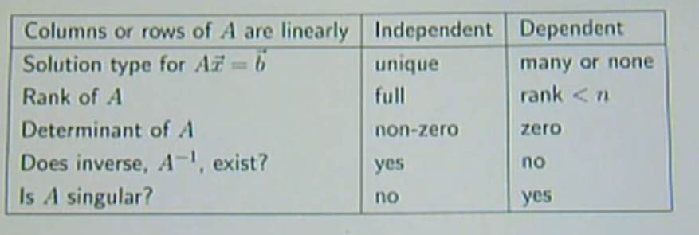

#### Solving with PLU

$A = P^{-1}LU$

$A \vec x = \vec b$
$LU \vec x = P \vec b$

Find $\vec y$ then find $\vec x$
$L \vec y = P \vec b$
$U \vec x = \vec y$

#### Determinant and PLU

$$\det(A) = \det(P^{-1}) \cdot \det(L) \cdot \det(U)$$
$L$ and $U$ are triangular matrices so their determinants are equal to the product of their diagonal elements.
$$ \det(P) = det(P^{-1}) = (-1)^n $$
where $n$ is the number of row swap operations to form $P$.

#### How many solutions?

If the number of non-zero rows (rank) in $U$ is equal to the $n$ dimension of $U$ then the system of equations has a single solution.
$$\dim(A) = n^2$$
$$\text{rank}(U) = n$$
$$\text{solutions} = 1$$

Then to figure out if there are many or zero you have to solve the system of equations.

#### Linear Independence of Vectors

$\vec x = 0$ when vectors are linearly independendent
No unique solution when vectors are linearly dependent
