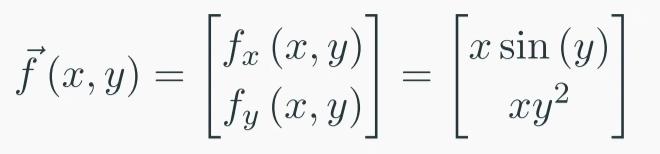
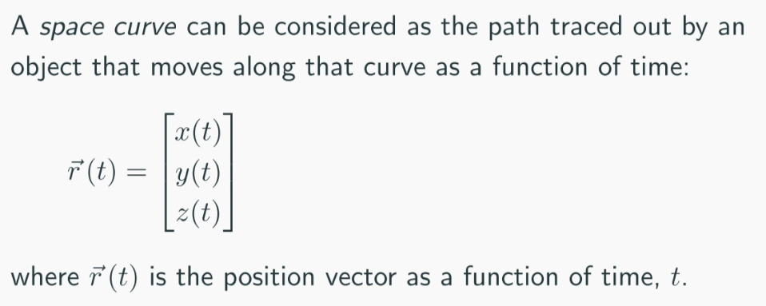

# Space Curves
contour plot and 3D surfaces are used to show two variable functions $f(x,y)$

Streamline and quiver plots are used to show vector functions

#### Parametric Equation
Independent variables, $x$ and $y$ are not directly related
$x(t) = \cos(t)$
$y(t) = \sin(t)$

#### Space Curves

