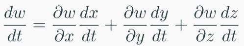

# Differential Calculus 1
$$ f(x,y) = x^2 + y^2 $$

partial derivative, treat other variable as a constant
$$ \frac{\partial f}{\partial x} = 2x $$
$$ \frac{\partial f}{\partial y} = 2y $$

$\frac{\partial^2 f}{\partial y^2}$ and $\frac{\partial^2 f}{\partial x^2}$ are non mixed second order partial derivatives

 $\frac{\partial^2 f}{\partial y \partial x} = \frac{\partial^2 f}{\partial x \partial y}$ usually and always in this course
 
 Multivariable Chain Rule
 
 
 
 