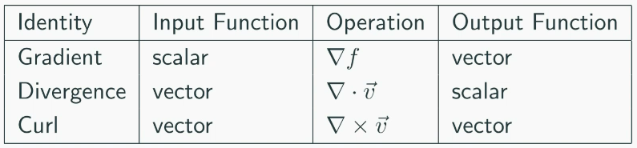

# Differential Calculus 3
## Vector Calculus

$\nabla:$ vector differential operator (del or nabla)
$$\nabla = \frac{\partial}{\partial x} \hat{i} + \frac{\partial}{\partial y} \hat{j}$$

$\nabla f$ points in the direction of maximum rate of change of $f$
$||\nabla f||$ equals the maximum rate of change of $f$

gradient vector will be zero at a stationary point
- Local maximum: all local gradient vectors point inwarads
- Local minimum: all local gradient vectors point outward
- Saddle point: mixture of gradients vectors pointing inwards and outwards

### Directional Derivative
$D_b f = \hat{b} \cdot \nabla f$
$\nabla f$ is always perpendicular to a contour line
