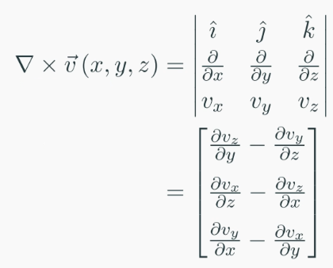

# Differential Calculus 4
#### Divergence of a Vector Function
$$\nabla \cdot \vec{v}(x, y, z) = \frac{\partial v_x}{\partial x}+\frac{\partial v_y}{\partial y}+\frac{\partial v_z}{\partial z}$$

- $\nabla \cdot \vec{v} > 0:$ The vector function is locally expanding (diverging)
- $\nabla \cdot \vec{v} < 0:$ The vector function is locally contracting (converging)
- $\nabla \cdot \vec{v} = 0:$ The vector function is incompressible 

#### Curl of a Vector Function

Curl indicates the direction and mgnitude of the local rotation of $\vec{v}$
- The curl points along the axis of rotation
- The curl magnitude indicates the amount of local rotation

if curl is zero everywhere, the function is irrotational

