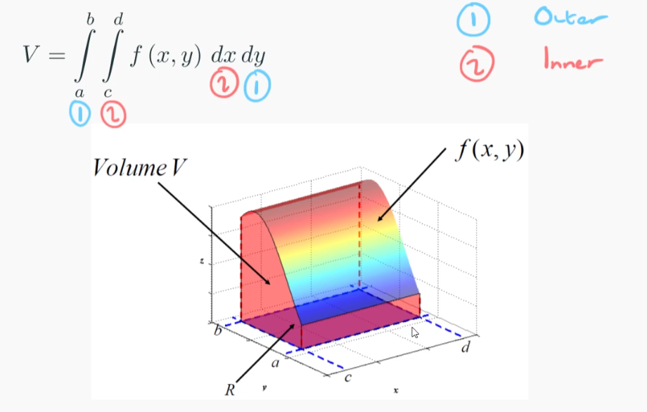
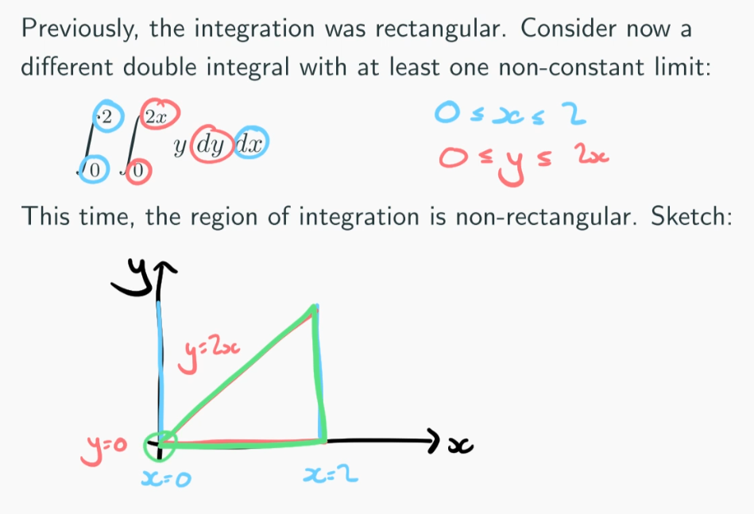

# Integral Calculus 1
Volume under a surface

The integration region (limits of the integrals) is sometimes called $R$
The inner integral represents slices of the volume, the outer integral then integrates these slices giving a volume

Since the other variables are constant you can bring them out of the integral.

Inner integral may have non-constant limits

#### Changing order of integration with constant limits

You can just switch around the integrals with their limits

