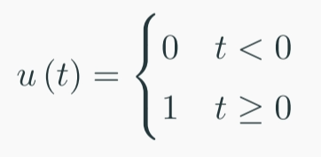
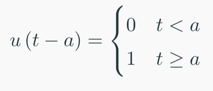
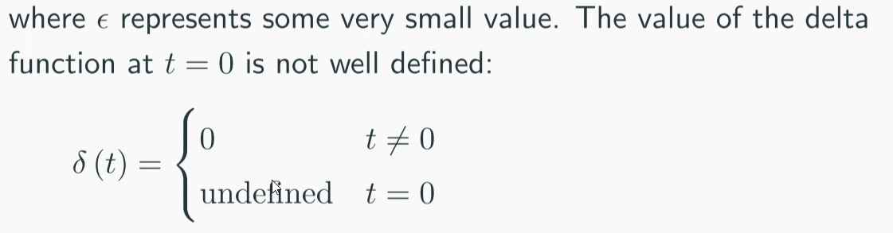
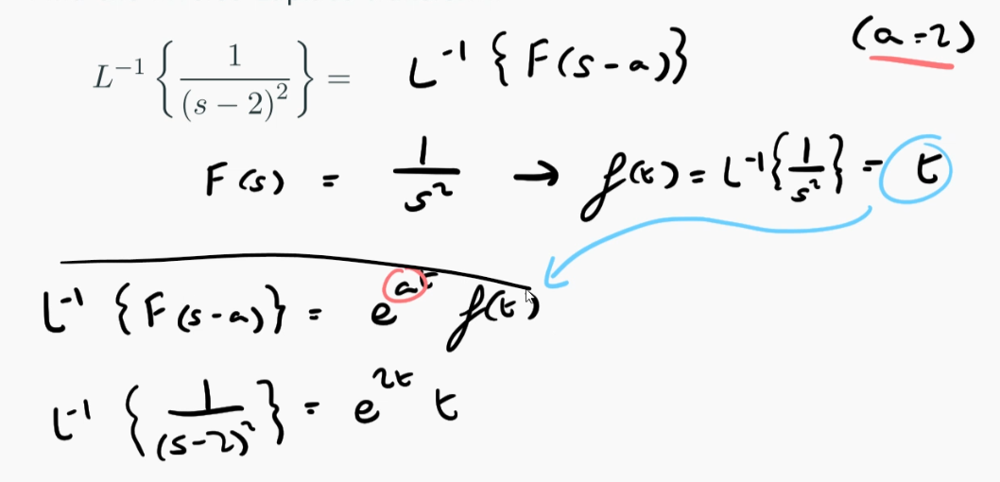
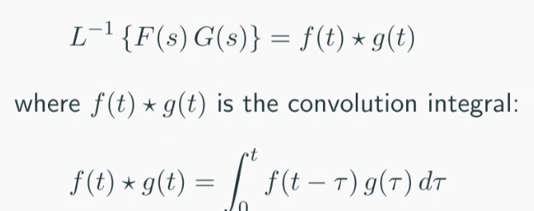

# Laplace Transform Part 2

#### Step and Delta Functions

Unit Step Function

Shifted United Step Function

$$L\{u(t-a)\} = \frac{e^{-as}}{s}$$

Dirac Delta Function
$$ \int^{\epsilon}_{-\epsilon} \delta(t) \space dt = 1 $$

$$ L\{\delta(t-a)\} = e^{-as} $$

### Useful Laplace Theorems
Linearity, you can put multiplying constants out
$$ L\{af(t)\} = aL\{f(t)\} $$

Shift-in-$s$ Theorem

Shift-in-$t$ Theorem
$$ L\{u(t-a)f(t-a)\} = e^{-as}F(s) $$
$$ L^{-1}\{e^{-as}F(s)\} = u(t-a)f(t-a) $$

Convolution Theorem
